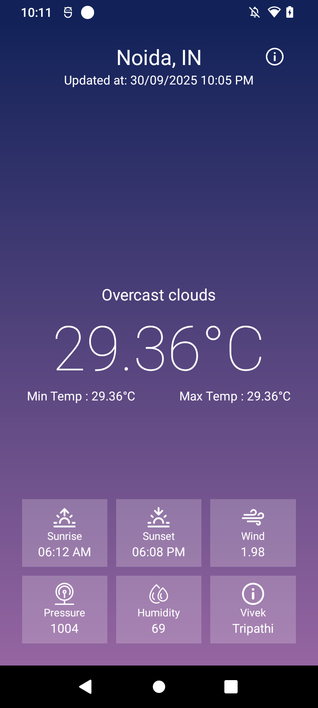
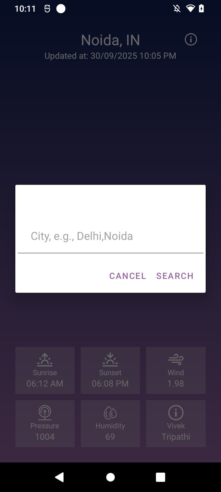

# 🌦️ Weather App (Android - Kotlin)

A simple weather app built using **Kotlin**, **MVVM architecture**, **DataBinding**, and the **OpenWeatherMap API**.  
It fetches real-time weather data such as temperature, humidity, and conditions for any city entered by the user.

---

## ✨ Features
- 🌍 Search weather by city name
- 🌡️ Real-time temperature, humidity, wind speed, and conditions
- 📱 Modern **MVVM + DataBinding** architecture
- 🎨 Simple and clean UI

---

## 🛠️ Tech Stack
- **Language:** Kotlin
- **Architecture:** MVVM (Model-View-ViewModel)
- **UI:** DataBinding, ViewModel, LiveData
- **API Provider:** [OpenWeatherMap API](https://openweathermap.org/api)
- **Build Tool:** Gradle

---

## 🚀 Getting Started

### Prerequisites
- Android Studio installed
- OpenWeatherMap API key (sign up [here](https://openweathermap.org/))

### Installation
1. Clone this repository:
   ```bash
   git clone https://github.com/tripathivivek98/weathercast.git
2. Open project in Android Studio.

3. Add your API key in WeatherViewModel.kt:
    ```bash
   private val API: String = "YOUR API KEY"
   
4. Build & run the app on an emulator or device.


## 📱 Screenshots
<p align="center">
  
  
</p>


## 🤝 Contributing
Contributions are welcome!<br>
Feel free to fork this repo, raise issues, and submit PRs.


👤 Author : Vivek Tripathi

💼 [LinkedIn](https://www.linkedin.com/in/vivek--tripathi/)

🐙 [GitHub](https://github.com/tripathivivek98)
